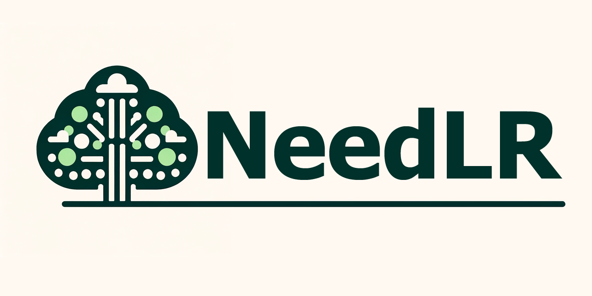
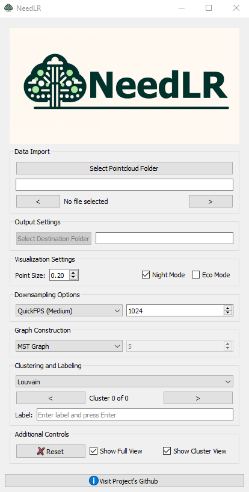

# NeedLR

## Description

Welcome to NeedLR, a specialized tool for Needle-like precision in Labeling and Rendering point cloud data. NeedLR offers an intuitive interface for detailed annotation and visualization of pointcloud data, perfect for academic research, ecological studies, and forestry management. The application leverages advanced algorithms to efficiently process and annotate large-scale point cloud data, ensuring high accuracy and ease of use.

## Features

- **Advanced Downsampling**: Utilize various downsampling techniques for efficient point cloud processing.
- **Superpoint Graphs**: Create and utilize superpoint graphs for effective data segmentation.
- **Community Detection**: Implement community detection algorithms for enhanced data clustering.
- **Customizable Labeling**: Flexible labeling system with options for different classes and annotations.
- **Interactive Visualization**: Dynamic and interactive 3D visualization of point cloud data.
- **GPU Acceleration**: Leverages GPU acceleration for fast and efficient computations.

## Getting Started

### Dependencies

- Python 3.8.5
- PyQt5
- NumPy
- Open3D
- Mayavi
- fpsample (for FPS downsampling)
- Other dependencies listed in `requirements.txt`.

### Installing

Clone the repository and install the required packages:

```bash
git clone https://github.com/your-username/NeedLR.git
cd NeedLR
pip install -r requirements.txt
```

### Executing Program

To run NeedLR, execute the following command in the project directory:

```bash
python main.py
```

### Usage



- Select a point cloud file or folder to begin annotation.
- Select destination folder to store annotations in JSON format. 
- Choose downsampling and community detection algorithms as required.
- Use the GUI to navigate through point clusters and label them.
- Save annotated data for further analysis or model training.

### Annotation Schema

- **Format**: Annotations are serialized in JSON, providing a standardized and machine-readable format.
- **Structure**: Data is organized into clusters, each uniquely identified by a `cluster` key.
- **Content**:
  - `label`: Each cluster includes a `label` key, storing user-assigned annotations as numerical string values.
  - `points`: A nested array under `points` enumerates the coordinates (x, y, z) of each point within the cluster.

## Algorithms

### Downsampling Algorithms

- **Random**: Randomly selects a subset of points from the point cloud, reducing the number of points while maintaining a representation of the overall structure.
- **Farthest Point Sampling (FPS)**: Selects points iteratively, where each new point is the farthest away from all previously selected points. Useful for preserving spatial distribution.
- **FPS + NPDU**: FPS combined with Nearest-Point-Distance-Updating, enhancing performance by updating nearest point distances during the selection process.
- **FPS + NPDU + KDTree**: Integrates KDTree with FPS and NPDU, offering a balance between accuracy and computational efficiency.
- **QuickFPS (Small/Medium/Large)**: A bucket-based FPS variant that divides the point cloud into buckets for faster processing, suited for different data sizes.

### Graph Construction Algorithms

- **K-Nearest Neighbors (KNN)**: Creates a graph by connecting each point to its K nearest neighbors, preserving local structures.
- **Minimum Spanning Tree (MST)**: Constructs a tree that connects all points in such a way that the total length of the edges is minimized, capturing the essential structure of the point cloud.

### Clustering Algorithms

- **Label Propagation**: Identifies communities in a graph by propagating labels throughout the network and forming clusters based on the convergence of these labels.

- **Asynchronous Label Propagation**: An asynchronous variant of label propagation that improves performance and scalability. Utilizes edge weights to influence community formation.

- **Louvain**: Maximizes modularity through a two-step iterative process. Efficient for large networks, it groups nodes into communities and then aggregates nodes of the same community.

- **Modularity Maximization**: Finds communities by greedily optimizing modularity using Clauset-Newman-Moore algorithm, suitable for detecting communities in large networks.

- **Kernighan-Lin Bipartitions**: A network partitioning method that divides the graph into two communities by iteratively swapping pairs of nodes to reduce the edge cut between them.


## License

This project is licensed under the MIT License - see the LICENSE file for details.

## Acknowledgments

    Thanks to the contributors of the [fpsample library](https://github.com/leonardodalinky/fpsample) for efficient downsampling algorithms.